# Covid-19 Detection from Chest X-ray scans using CNN

Covid Detection using CNN based classification model trained on chest x-ray scans of normal and people diagnosed with covid. We trained a Convolutional Neural Network designed to process these x-ray images of the chest with pre-classified labels from the training set to replicate those results on the test set.

## Data Visualization & Preprocessing

# Dataset 1

This is the first dataset we have used for training our model. It has around 6000 chest x-ray images of different people belonging to two different classes, normal or sick. 

We trained on a dataset of:

- over 5216 total x-ray images
- 1341 x-ray images of normal class
- 3875 x-ray images of covid class
- highly imbalanced

Images from both the classes

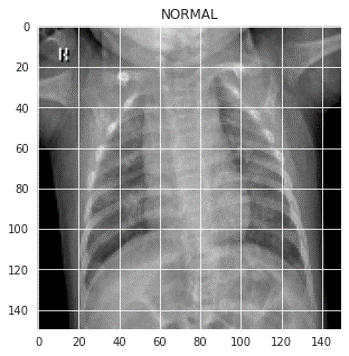
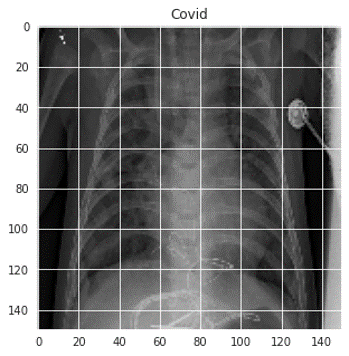

Visualizing the data

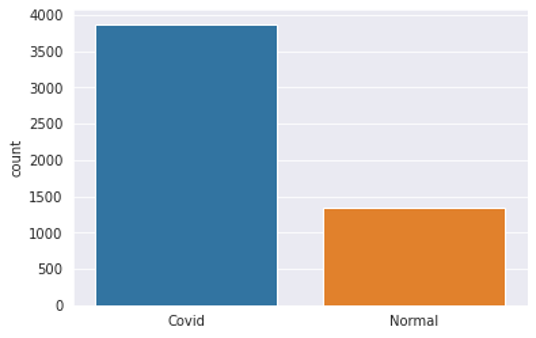

Performance

- Training set accuracy = 95.48%	    
- Test set accuracy = 85.4%

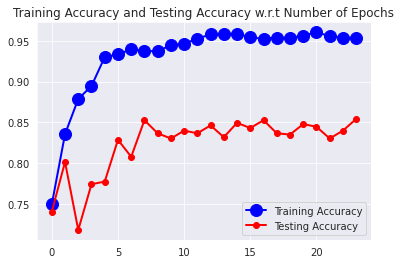
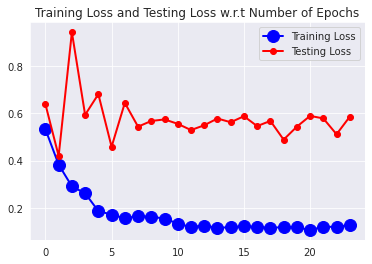

As you can clearly see the data is imbalanced. Training a model on this imbalanced data would result in naive behaviour where the model would be always favoring the covid class and still produce a decent accuracy but such results would be useless. To avoid this overfitting, we will increase the number of training examples using data augmentation.

# Dataset 2

This is the second dataset we have used for training our model. It has around 21000 chest x-ray images of different people belonging to four different classes. 

We trained on a dataset of:

- 10192 x-ray images of Normal class
- 3616 x-ray images of Covid class
- 6012 x-ray images of Lung opacity class (non-covid lung infection)
- 1345 x-ray images of Viral Pneumonia class

Images from both the classes

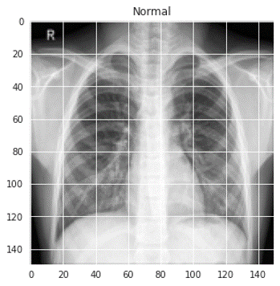
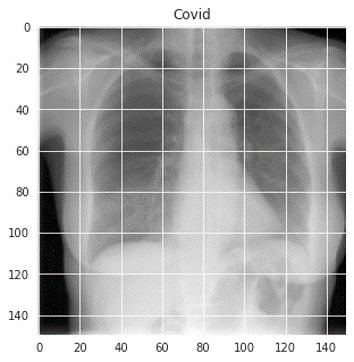
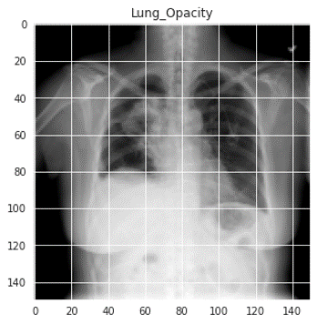
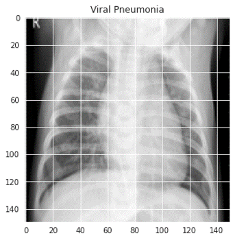

Visualizing the data

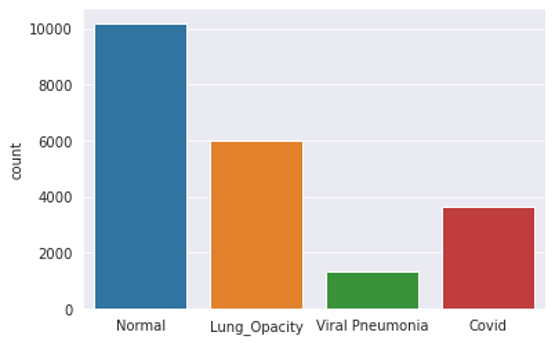

Performance

- Training set accuracy = 98.65%	    
- Test set accuracy = 92.98%

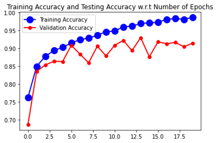
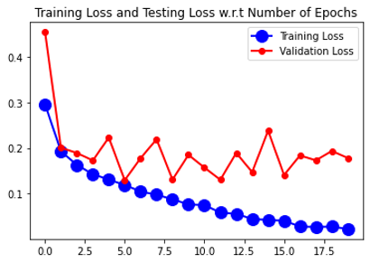

## Model details

|Layer (type)                 |   Output Shape      |  Param    |  
|-----------------------------|---------------------|-----------|
|conv2d-5 (Conv2D)            | (150, 150, 32)      | 320       | 
|max-pooling2d-5 (MaxPooling2 | (75, 75, 32)        | 0         |  
|conv2d-6 (Conv2D)            | (75, 75, 64)        | 18496     |
|max-pooling2d-6 (MaxPooling2 | (38, 38, 64)        | 0         |
|conv2d-7 (Conv2D)            | (38, 38, 128)       | 73856     |
|max-pooling2d-7 (MaxPooling2 | (19, 19, 128)       | 0         |
|conv2d-8 (Conv2D)            | (19, 19, 128)       | 147584    |
|max-pooling2d-8 (MaxPooling2 | (10, 10, 128)       | 0         |
|flatten-1 (Flatten)          | (12800)             | 0         |
|dropout-4 (Dropout)          | (12800)             | 0         |
|dense-2 (Dense)              | (512)               | 6554112   |
|dense-3 (Dense)              | (1)                 | 513       |

Total params: 6,794,881

Trainable params: 6,794,881 

Non-trainable params: 0 

_________________________________________________________________

#### Inputs and output

- The **input** is a batch of images and each image has a shape (150,150,1).
- The **output** represents a binary classification of the input images as 1 (Covid) or 0 (Normal).

## Results

On the test set, we achieved:

- Accuracy  = 0.92
- F1-score  = 0.92
- Recall    = 0.90
- Precision = 0.98 

# Model type conversion

The model was converted into a TFLite model using the TFLiteConverter for deploying it to android Apps.

## Covid Testing App

- The app uses the generated tflite model for image classification. 
- User Uploads the chest X-ray of the person.
- The image is first converted into a bitmap and then each pixel is extracted and stored into a ByteBuffer.
- An Interpreter object is instantiated which holds the tflite model.
- This interpreter object is then invoked by passing 2 ByteBuffer objects (the input and the output), the output is modified during this call.

## App Permissions
- READ EXTERNAL STORAGE

## Screenshots

